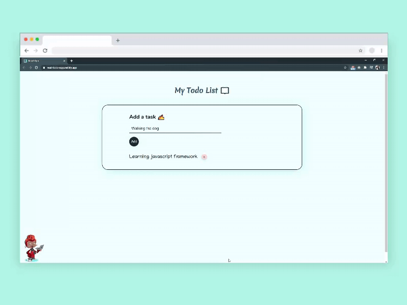
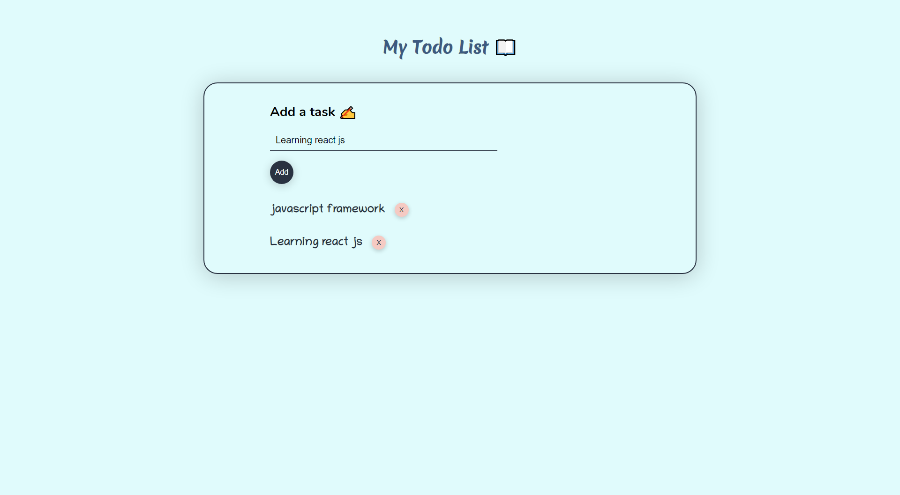

# React-todo-app

[](https://app.netlify.com/sites/reat-todo-app/deploys)

## Live Code - [Preview](https://reat-todo-app.netlify.app/)
<!-- ctrl+shift+v : preview -->


> This website was built to practice my react skills

---

### Table of Contents
You're sections headers will be used to reference location of destination.

- [Description](#description)
- [How To Use](#how-to-use)
- [Author Info](#author-info)

---

## Live Code - [Preview](https://reat-todo-app.netlify.app/)

## Description

This was a simple react app that I build by the help of Tech Tiffin. 
You can add new items to the todo list and you can also delete it from the list. I enjoyed coding it and I learned a lot about using event handlers in React and how to manipute the state of the class component.

#### Technologies

- HTML
- CSS
- JAVASCRIPT
- React JS

[Back To The Top](#React-todo-app)

---

#### Installation
```html
    Use a command Prompt and type : npm install
```

## How To Use
```html
    Use a command Prompt and type : npm start
```
<br>



<br>

## Author Info

- Twitter - [@TracyCss](https://twitter.com/TracyCss)

[Back To The Top](#React-todo-app)
